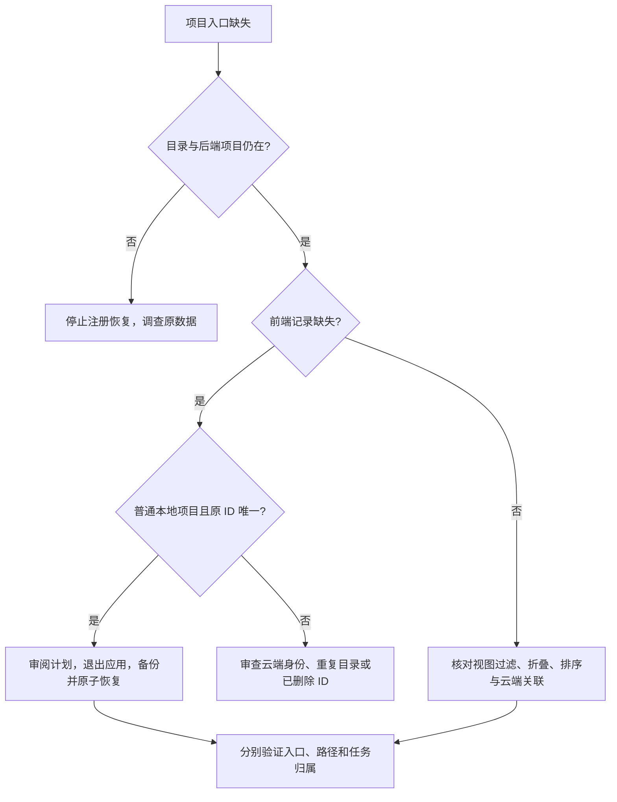

# Codex local project recovery

Windows 上的 Codex 本地项目注册恢复工具。仅使用 Python 标准库；先审计、生成明确计划，退出 Codex 后从独立终端执行。

**这不是 OpenAI 官方工具。** 桌面应用状态格式不是稳定公共 API。本工具只接受已识别的 JSON + SQLite 结构，遇到其他版本或结构会停止，不把所有状态文件当作 JSON。

## 能做什么

- 从 `.codex-global-state.json` 和 `state_5.sqlite` 读取当前注册、历史项目、根目录及已有 ID 对应关系。
- 可选读取 session/turn 元数据，规范化 Windows 路径；不会根据正文里提及的路径创建项目。
- 恢复由现存后端记录、唯一历史 ID 和有效目录共同证实的普通本地项目。
- 写入前重新核对计划、检查应用退出、创建带时间戳的 JSON 和 SQLite 备份。
- 只修改 JSON 中的项目记录、对应映射和排序，使用同目录临时文件及原子替换，写后读回验证。

## 明确的边界

- 不生成项目 ID，不创建新的后端项目，不编辑 SQLite，不删除数据。
- 不自动注册 worktree，不把 cwd 出现过一次就认定为主项目。
- 不自动恢复已删除的后端实体、同目录重复项目或含多个历史 ID 的歧义项。
- **不自动处理 ChatGPT 关联项目，也不修改任务归属。** 普通本地入口、云端项目身份、本地任务归属是不同层次。看到本地文件或后台项目记录，不代表侧边栏入口和旧任务分组一定正确。
- 不修改应用源码、功能开关或云端记录。没有适用于所有版本的万能修复。

## 使用流程

需要 Python 3.10+。先尝试现有 `python` 或 `py -3`；Codex 附带 Python 也可使用其绝对路径，不要求重装环境。

在本仓库目录打开 **独立 PowerShell**。不要把离线修复进程挂在即将退出的 Codex 进程下。

```powershell
python recover.py audit --out .local/audit.json --sessions
```

阅读 `.local/audit.json` 中的 `current_projects`、`candidates`、`reasons` 和 `deleted_backend_aliases`。报告含个人路径和项目 ID，应保存在本地。

只选择 `eligible: true` 的 `legacy_id`，逐项确认项目名称和全部根目录。下面的 `<legacy-id>` 必须换成报告里的真实 ID；不要自行编造。

```powershell
python recover.py plan --select "<legacy-id>" --out .local/plan.json
# 多项目：重复 --select 参数
python recover.py check .local/plan.json
```

计划包含将写入的完整记录和证据指纹。再次核对，然后 **完全退出 Codex/ChatGPT，以及访问同一环境的 Codex CLI**。保留独立 PowerShell 窗口。

```powershell
python recover.py apply .local/plan.json --confirm
```

`--confirm` 表示你已审阅计划并批准这些写入。检测到应用进程、原记录变化或目录缺失会停止。工具不会替你结束进程。

看到 `SUCCESS` 后重新打开 Codex，检查三个不同的结果：

1. 项目入口是否出现；
2. 入口指向的本地目录是否正确；
3. 旧任务是否出现在预期位置。

第三项不会由本工具擅自修正。若失败，不要循环运行同一份旧计划，重新 audit/check 并审查原因。

自定义 Codex 目录时，`--home` 放在子命令前：

```powershell
python recover.py --home "D:\MyCodexHome" audit --out .local/audit.json
```

`check/apply` 使用计划中记录的 home，不重新指定其他目标。

## ChatGPT 关联项目的诊断流程

对 `g-p-…` ID 或 `.chatgpt-projects` 下的目录，报告会标记 `cloud_linked_needs_separate_review`。不要改掉 ID 前缀来绕过筛选。

先分别记录云端 ID、普通本地 ID、后端 ID、本地根目录、任务的显式归属，以及接口和实际侧边栏是否一致。保留多个本地入口时必须明确它们分别指向哪个目录。

在一次对 Windows 26.903.9818.0 客户端的源码与界面核对中，确认有两个独立的过滤条件：项目列表工具过滤 `g-p-…` ID；Codex 视图还会按路径过滤根目录直接位于 `.chatgpt-projects` 下的本地项目组，ChatGPT 视图则不执行后一个过滤。后一个条件意味着，即使换成普通 UUID，同目录的新项目仍可能不显示。这个结论是特定版本的本地验证结果，不是所有版本的公开接口保证。

遇到此情况，先切换左上角的应用视图，核对 ChatGPT 项目入口及其本地任务操作。不要先新建重复项目、添加无关根目录或修改应用包来绕过显示条件。另行创建本地项目只能建立一个新身份，不会自动继承旧任务。需要新身份时由客户端生成真实 ID，并另行审阅关联变更；本工具不执行该操作。



## 备份与回退

默认备份位于 `.local/backups/<时间戳>/`，包括原始 JSON、SQLite 的一致性备份和写入验证结果。

本工具没有修改原 SQLite，因此通常只需在完全退出应用后回退 JSON。先保留失败后的当前 JSON，再将选定备份的原始 JSON 通过同目录临时文件原子替换回原路径。**不要盲目回退 SQLite 或恢复旧会话数据库**，否则可能覆盖后来产生的数据。

未提供一键回退按钮：回退前需要判断备份之后是否产生了应保留的新项目和设置。

## 发布到 GitHub

只上传本仓库目录中的源码、测试、说明和 CI 文件。**不要上传上一级目录，也不要上传审计报告、修复计划、客户端状态、备份、会话或日志。** `.gitignore` 是额外保护，不代替检查提交内容。

```powershell
python -m unittest discover -s tests -v
git init
git add recover.py README.md .gitignore tests .github
git diff --cached --stat
git diff --cached
# 检查完个人数据后再 commit 和 push 到你自己的仓库。
```

包含 GitHub Actions 测试配置；本地通过不代表已在 GitHub 执行。应用恢复只在 Windows 启用，核心逻辑使用临时目录在 Windows/Linux CI 中测试。工作流写法参照 [checkout 官方说明](https://github.com/actions/checkout) 和 [setup-python 官方说明](https://github.com/actions/setup-python)。

## English summary

Audit first, select verified existing legacy IDs, review the exact plan, fully close Codex, and apply from an independent terminal. The tool restores only ordinary local registrations in a recognized desktop JSON/SQLite schema. It does not create IDs, reassign tasks, modify the backend database, or fix cloud-linked project UI. Private reports and backups must never be uploaded.
